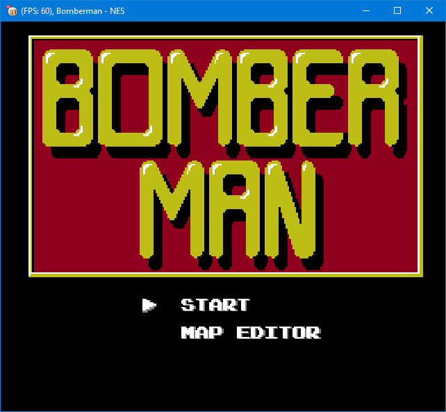
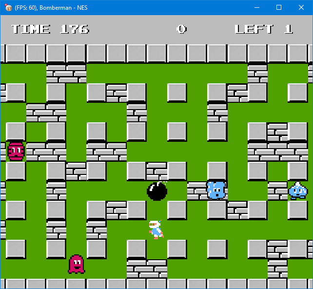

# Practica Java 021 - NES

Bomberman en Java.

Inicialmente este proyecto fue desarrollado en la universidad en el año 2012 y posteriormente fui realizando modificaciones para mejorarlo con el paso del tiempo con fines de aprendizaje y entretenimiento.

## Información

Actualmente siendo desarrollado en NetBeans 8.2.

Utilizado Java 8 Update 45 de 64 bits.

En versiones de Java 8 superiores a la Update 60, puede dar problemas con la tubería de OGL utilizada en algunas tarjetas gráficas.

Más información del problema anterior: [Aquí](https://bugs.openjdk.java.net/browse/JDK-8080677)

## Construcción

Para construir la aplicación actualmente se requiere:

* NetBeans 8 **\***.
* Java SDK 8.

Nota: **\*** No limitativo, ya que facilmente se puede construir a través de cualquier otro IDE.

Posteriormente incluiré un script para que el proceso de construcción sea agnóstico de un IDE.

## Ejecución

Una vez obtenido o descargado el .jar puede ejecutar la aplicación de dos formas:

1. Doble clic si tiene la extensión .jar asociada a java.
2. A través del siguiente comando en una consola:
```bash
   java -jar "Practica_Java_021_-_NES.jar
```

## Controles por teclado.

* **Pad arriba**: Flecha arriba.
* **Pad abajo**: Flecha abajo.
* **Pad derecha**: Flecha derecha.
* **Pad izquierda**: Flecha izquierda.
* **A**: X.
* **B**: Z.
* **Select**: Shift.
* **Start**: Enter.

## Capturas.





## Notas de la versión

* [3.0.0](./docs/release-notes/3.0.0.md)
* [3.0.0-beta.0](./docs/release-notes/3.0.0-beta.0.md)

## Contribuyendo a este proyecto

¿Te has encontrado con algún problema? De ser así siéntete libre de informar a través del rastreador de incidencias.

A través del rastreador de incidencias puede reportar ya sea errores encontrados encontrados en una versión específica del juego o alguna nueva característica que desee solicitar.

## Créditos

Le doy las gracias a [Félix Coa](https://github.com/felixcoa13) ya que sin él en aquel entonces no se hubiese desarrollado este juego.

## Licencia

Licenciado bajo la Licencia [MIT](LICENSE).